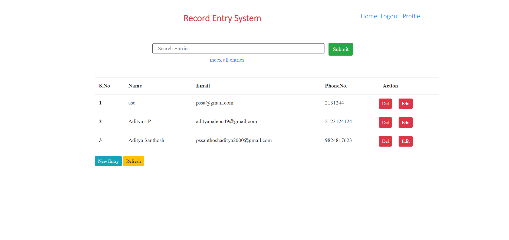

# **Record Entry Management System**

*You can view the site url here*

https://github.com/AdityaSanthosh/Record-Management-System

**_Features_** :

* Each user can have their own profile, Bio

* Add New Entries, Edit them, Delete them, Update them!

* Index all entries in order to query them fast.

* Search Functionality implemented with Unordered Hash Maps (Python Dicts)

* Front End is written in Bootstrap, HTML

* Back End is written in Django, Python

I did this project to learn more about backend topics
like database persistance, Authentication, Authorization, Indexing, Regex, Data Structure Implementation, production and deployment specifics in General and in Django, Model - View
pattern. 

